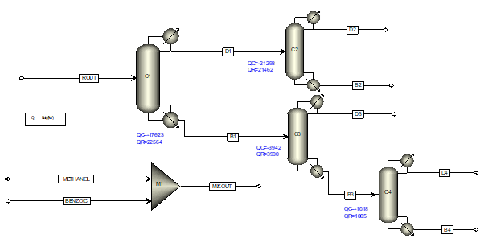

# Capstone Project: Methyl Benzoate Process Design

 <!-- Replace with actual image if available -->

## Overview
This repository contains the documentation, reports, simulations, and analyses for the CHE453 Process Design Capstone Project at the Indian Institute of Technology Kanpur. The project focuses on designing an economic flowsheet for the production of Methyl Benzoate via esterification of Benzoic Acid with Methanol. It integrates chemical engineering principles, including process synthesis, simulation using Aspen Plus, thermodynamic modeling, economic analysis, and energy optimization.

- **Duration**: August 2025 - Ongoing
- **Course**: CHE453 Process Design Capstone Project
- **Instructor**: Prof. Raghavendra Ragipani (ragipani@iitk.ac.in)
- **Group Size**: 6-8 students (Self-formed)
- **Key Requirements** (from Course Deliverables):
  - ≥4 components
  - ≥1 reactor block
  - ≥2 separation steps (at least one distillation)
  - ≥3 heat exchangers (excluding distillation auxiliaries)
  - ≥1 recycle loop
  - Rankine cycle-based captive power plant
  - Cooling water loop with cooling tower

The project workflow includes process selection, material balances, thermodynamic validation, reactor and separation design, simulation with recycles, heat exchanger network design, dynamics/control, and techno-economic analysis. Bonus for innovative approaches.

## Team Members
- Aaditya Amlan Panda (220007)
- Abhijit Dalai (220030)
- Adarsh Pal (220054)
- Akash Kumar Gupta (220095)
- Kushagra Tiwari (220574)
- Saurabh Yadav (220991)
- Snehil Tripathi (221071)
- Tushar Verma (221147)

## Project Objectives
The primary goal is to design a complete process for Methyl Benzoate production, ensuring economic viability, energy efficiency, and compliance with specifications. Key activities include:
- Process identification and chemistry consideration.
- Material and energy balances with assumptions.
- Thermodynamic model selection and validation (e.g., UNIQUAC for VLE).
- Conceptual synthesis, distillation sequencing, and reactor design.
- Aspen Plus simulations for flowsheet development and optimization.
- Heat integration using pinch technology.
- Utility cost estimation and techno-economic analysis.
- Dynamics and control for key units (e.g., distillation).
- Integration of a sub-critical Rankine cycle power plant and cooling water system.

## Key Achievements and Progress
Based on bi-weekly reports and course deliverables:

- **Process Identification**: Selected esterification of Benzoic Acid with Methanol using HCl catalyst. Feed: Methanol (16.95k moles), Benzoic Acid (2.7k moles with 0.5% Phthalic Acid impurity). Product: Methyl Benzoate (7352.94 + 0.0029k moles, with minor Benzoic Acid leakage). Scaling factor 'k' for optimization (break-even at k=437 for 50% profit margin).
  
- **Economic Feasibility Analysis**: 
  - Market Trends: Methanol (USD 345–370/MT, CAGR 4.7% to USD 49.78B by 2034); Benzoic Acid (USD 1,010–1,140/MT, CAGR 5.3% to USD 1,853.5M by 2033); Methyl Benzoate (USD 2,200/MT, CAGR 6% to USD 2,260M by 2032).
  - Drivers: Clean fuel alternatives, bio-methanol, pharmaceuticals, fragrances, and food preservatives.
  - Input-Output Cost: Profit = 2200 - 0.529k (USD, scaled).

- **Thermodynamic Model Selection and Validation**: UNIQUAC selected as best fit for binary mixtures (e.g., Methanol-Water, Methanol-Benzoic Acid). T-xy plots generated; azeotrope identification performed. No azeotropes at operating pressure (1 bar).

- **Operating Conditions**: Molar ratio (Methanol:Benzoic Acid:HCl = 16.59:2.7:0.1215); Temperature: 25°C (liquid phase, prevents side reactions); Pressure: 1 bar (cost-effective, no azeotropes).

- **Flowsheet Development in Aspen Plus**:
  - Two methods compared for distillation configurations.
  - Assumptions: 80% reactor conversion (recycles pending).
  - Results: 98%+ recovery for Methyl Benzoate and Benzoic Acid; Energy balances validated (e.g., QR_total ~49,902 kW, QC_total ~-44,764 kW in Method 1).
  - Block Diagram and Stream Tables included in reports.

- **Property Analysis**: Solubility, VLE calculations, and sensitivity analysis for optimization.

- **Captive Power Plant**: Designed a 10 MW sub-critical Rankine cycle (steam ≤550°C, turbine efficiency 90%, cooling water 25-40°C). T-S plots and intermediate states to be generated.

- **Future Work (Upcoming Bi-weekly Reports)**:
  - Distillation design and sequencing.
  - Reactor kinetics and detailed design.
  - Recycle loops, sensitivity analysis, and optimization.
  - Heat exchanger network (pinch technology).
  - Dynamics/control for distillation.
  - Full techno-economic analysis and innovative components.

## Repository Structure
- **docs/**: Attached PDF documents (Report_No_1.pdf, Report_No_2.pdf).
- **simulations/**: Aspen Plus files (e.g., flowsheets for Method 1 & 2) 
- **reports/**: Bi-weekly reports
- **figures/**: Block diagrams, T-xy plots, T-S curves, market trends graphs.
- **data/**: Market data, cost tables, thermodynamic parameters.

## Tools and Software
- **Aspen Plus**: For flowsheet simulation, material/energy balances, and sensitivity analysis.
- **Thermodynamic Models**: UNIQUAC, NRTL, PENG-ROB (validated against NIST data).
- **Other**: MATLAB/Python for data analysis (if needed); Literature sources (e.g., Roberts & Urey 1938, ChemAnalyst).

## How to Run Simulations
1. Install Aspen Plus
2. Load `.apw` files from `/simulations/`.
3. Run with UNIQUAC property method.
4. Adjust scaling factor 'k' and recycle parameters for optimization.

## References
- Course Handouts: CHE453_FCH.pdf, CHE453_Deliverables.pdf.
- Power Plant Design: powerplant.pdf (Rankine cycle guidelines).
- Market Sources: Methanex, ChemAnalyst, Polaris Market Research, Dimension Market Research, DataIntelo.
- Literature: Roberts & Urey (1938) on esterification; Journal of Chemical Research on solubility.

## Contact
For questions, reach out to team members or Prof. Raghavendra Ragipani.
